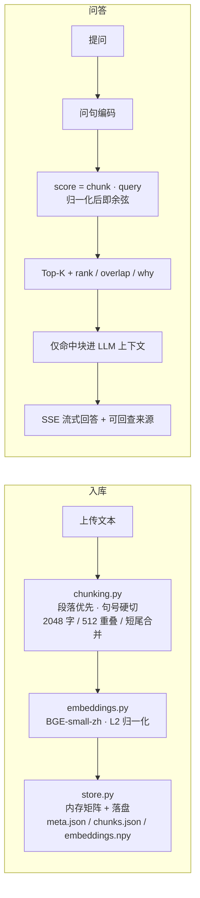

# 径舟 · JingZhou

[](LICENSE)
[](https://www.python.org/)
[](https://fastapi.tiangolo.com)

> 书山有径，学海泛舟。

**径舟** 是一个面向中文教材的多文档 RAG 学习助手：资料投进书斋，系统用 BGE 中文向量做检索，大模型**只根据命中片段**回答，并一键生成闪卡、测验、思维导图、学习指南等学习材料。产品形态对标 NotebookLM / 腾讯 IMA——「资料在先，回答必须带出处」。

与黑盒包装的 RAG 应用不同，径舟把检索过程做成透明可验证的：切块、编码、相似度、落盘、引用回查各自成模块，每次命中都带分数与入选原因，回答里的来源笺可以逐条点开原文核对。

## 克隆后 5 分钟跑起来

需要 Python 3.10+，以及任意 OpenAI 兼容接口的 Key（官方 / 中转 / 国产均可）。

```bash
git clone https://github.com/Dionysianspirit/jingzhou.git
cd jingzhou
./start.sh          # Windows 双击 start.bat
```

启动脚本会自动建虚拟环境、装依赖，并在首次运行时引导你填入 API Key（也可手动 `cp .env.example .env` 填写）。服务就绪后打开 <http://127.0.0.1:8777>：

1. 左侧点「载入示例教材《线性代数导引》」，或直接拖入自己的 PDF / TXT / MD
2. 选中卷册，提问，例如「秩-零化度定理在说什么？」
3. 点回答下方的来源笺，核对命中的原文片段与检索分数
4. 顶栏「指南」一键生成导读、要点与思考题；关掉进程再开，卷册仍在（向量已落盘）

另有一个最小化的 API 走查页在 `/demo.html`，可用来逐接口验证检索与生成链路。

运行测试：

```bash
python -m unittest discover -s tests -v
```

## 功能特性

| 能力 | 说明 |
| --- | --- |
| 💬 伴读问答 | 多文档语义检索 + SSE 流式回答，引用格式 `[来源: 文档名 片段N]`，书童「小舟」人设可自定义 |
| 📜 拖拽投卷 | PDF 由浏览器端 pdf.js 解析取字，TXT / MD 直传，全程文本不出本机（仅命中片段送 LLM） |
| 🔍 可解释检索 | 独立 `/api/search` 接口，每个命中块返回余弦分数、排名、字词重叠与一句话入选原因 |
| 📌 点击溯源 | 来源笺点开即原文（`/api/docs/{id}/chunks/{i}`），引用可验证而非模型编造 |
| 💾 向量持久化 | 索引落盘 `data/store/`，重启自动读回，文档不必重传 |
| 📖 学习工具组 | 指南（导读/要点/易错/思考题）、笺卡翻转、考核（识海偏误图 + 研思足迹 + 四类错因）、脉络、析报、簿册、览图 |
| 🛟 无 Key 可跑 | 不配 LLM_API_KEY 时检索类接口照常工作，生成类接口优雅返回 503 |

## 检索管线



三个关键设计：

1. **切块不一刀切**：先按空行拼段，超长段在 2048 字内找最近句号切开并回带 512 字重叠，短于 200 字的尾巴并回上一块，避免无语义碎片向量。
2. **余弦即点积**：`normalize_embeddings=True` 使向量落在单位球上，`np.dot` 结果就是余弦相似度，分数跨查询可直接比较。
3. **生成被检索约束**：提示词禁止外部知识，未命中要求坦承「遍览全卷，未有所获」；引用带 `doc_id + chunk_idx`，前端可回查原文。

更多设计细节见 [INTERVIEW.md](INTERVIEW.md)。

## API 一览

| 方法 | 路径 | 说明 |
| --- | --- | --- |
| `GET` | `/api/health` | 健康检查：嵌入模型 / LLM 就绪状态、文档数 |
| `POST` | `/api/index` | 索引文档（doc_id + 纯文本，上限 10MB） |
| `POST` | `/api/remove` | 删除文档（内存与磁盘同步清理） |
| `GET` | `/api/docs` | 已索引文档列表 |
| `GET` | `/api/docs/{doc_id}/chunks/{chunk_idx}` | 取回指定片段原文（溯源回查） |
| `POST` | `/api/search` | 可解释检索，返回 score / rank / overlap / why |
| `POST` | `/api/chat` | RAG 问答（SSE 流式，含来源与解释字段） |
| `POST` | `/api/study-guide` | 生成学习指南（JSON，附来源） |
| `POST` | `/api/flashcards` · `/api/quiz` | 笺卡、考核（考核含错因分类） |
| `POST` | `/api/mindmap` · `/api/report` | 脉络（Markdown）、析报（SSE） |
| `POST` | `/api/infographic` · `/api/table` | 览图数据、簿册（JSON） |
| `POST` | `/api/sample` | 一键载入示例教材 |

## 配置

全部经 `.env` 注入（首次运行启动脚本会引导填写），见 [.env.example](.env.example)：

| 变量 | 默认 | 说明 |
| --- | --- | --- |
| `LLM_API_KEY` | 空 | 留空则仅检索可用，生成接口返回 503 |
| `LLM_BASE_URL` | `https://api.openai.com/v1` | 任意 OpenAI 兼容端点 |
| `LLM_MODEL` | `gpt-4o` | 对话模型 |
| `EMBED_MODEL` | `BAAI/bge-small-zh-v1.5` | 本地嵌入模型（默认走 hf-mirror 镜像，首启约百兆下载） |
| `CHUNK_CHARS` / `OVERLAP_CHARS` / `TOP_K` | `2048` / `512` / `8` | 切块与检索参数 |
| `JINGZHOU_DATA` | `./data` | 持久化与示例数据目录 |
| `PORT` | `8777` | 服务端口 |

## 项目结构

```
jingzhou/
├── app/                    # 后端包
│   ├── main.py             # FastAPI 路由与生命周期
│   ├── store.py            # DocStore：检索 / 持久化 / 解释字段
│   ├── chunking.py         # 段落感知切块（纯函数，可单测）
│   ├── embeddings.py       # BGE 模型加载与编码线程池
│   ├── llm.py              # OpenAI 兼容客户端、JSON 解析、错误脱敏
│   ├── schemas.py          # Pydantic 请求模型
│   └── config.py           # 环境变量与路径
├── server.py               # 兼容入口，等价于 uvicorn app.main:app
├── static/                 # 前端（零构建）
│   ├── index.html          # 书斋主界面
│   ├── studio.css / .js    # 样式与交互逻辑
│   └── demo.html           # API 走查演示页
├── data/
│   ├── sample/             # 内置示例教材《线性代数导引》
│   └── store/              # 向量落盘目录（已 gitignore）
├── tests/                  # unittest：切块与检索排序
├── start.sh / start.bat    # 一键启动（建 venv、装依赖、引导配置）
└── INTERVIEW.md            # 设计与讲述稿
```

## 回退

v0.1 单文件版本（含当时的方案说明书与演示素材）保留在分支 [`backup/pre-hardening`](https://github.com/Dionysianspirit/jingzhou/tree/backup/pre-hardening)：

```bash
git fetch origin && git checkout backup/pre-hardening
```

## 路线展望

- [x] 向量持久化
- [x] 可解释检索与来源回查
- [ ] BM25 混合检索
- [ ] 会话历史与多轮对话
- [ ] 更多文档格式（DOCX / EPUB）
- [ ] 闪卡导出 Anki

## 许可

[MIT License](LICENSE)

---

径舟书斋，伴读不倦。📖
