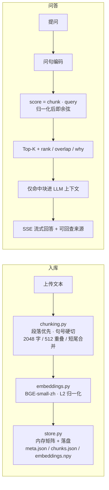

# 径舟 · JingZhou

  

> 书山有径，学海泛舟。

**径舟** 是一个面向中文教材的多文档 RAG 学习助手：资料投进书斋，系统用 BGE 中文向量做检索，大模型**只根据命中片段**回答，并一键生成闪卡、测验、思维导图、学习指南等学习材料。产品形态对标 NotebookLM / 腾讯 IMA——「资料在先，回答必须带出处」。

工程上刻意做成「可以把检索过程讲清楚」的项目：切块、编码、相似度、落盘、引用回查各自成模块，检索结果带分数与命中原因，来源可点击回查原文。

## 功能特性

| 能力 | 说明 |
| --- | --- |
| 💬 伴读问答 | 多文档语义检索 + SSE 流式回答，引用格式 `[来源: 文档名 片段N]`，书童「小舟」人设可自定义 |
| 🔍 可解释检索 | 独立 `/api/search` 接口，每个命中块返回余弦分数、排名、字词重叠与一句话入选原因 |
| 📌 点击溯源 | `/api/docs/{id}/chunks/{i}` 原样取回送进提示词的片段，引用可验证而非模型编造 |
| 💾 向量持久化 | 索引落盘 `data/store/`，重启自动读回，文档不必重传 |
| 📖 学习指南 | NotebookLM 式 Study Guide：导读、要点、公式、易错点、思考题，附来源 |
| 🃏 学习工具组 | 笺卡（闪卡）、考核（含四类错因归因）、脉络（思维导图）、析报、信息图、对比表 |
| 🛟 无 Key 可跑 | 不配 LLM_API_KEY 时检索类接口照常工作，生成类接口优雅返回 503 |

## 快速开始

需要 Python 3.10+，以及任意 OpenAI 兼容接口的 Key（官方 / 中转 / 国产均可，没有也能先体验检索）。

```bash
git clone https://github.com/Dionysianspirit/jingzhou.git
cd jingzhou
cp .env.example .env               # 填入 LLM_API_KEY
./start.sh                         # Windows 双击 start.bat
```

浏览器打开 <http://127.0.0.1:8777>。首次启动会从 HuggingFace 国内镜像下载嵌入模型 `BAAI/bge-small-zh-v1.5`（约百兆，之后本地缓存）。

载入内置示例教材《线性代数导引》，然后即可提问或检索：

```bash
curl -X POST http://127.0.0.1:8777/api/sample

curl -X POST http://127.0.0.1:8777/api/search \
  -H "Content-Type: application/json" \
  -d '{"query": "什么时候矩阵可以对角化？", "doc_ids": ["sample-linalg"]}'
```

运行测试：

```bash
python -m unittest discover -s tests -v
```

## 检索管线



三个可以展开讲的设计点：

1. **切块不一刀切**：先按空行拼段，超长段在 2048 字内找最近句号切开并回带 512 字重叠，短于 200 字的尾巴并回上一块，避免无语义碎片向量。
2. **余弦即点积**：`normalize_embeddings=True` 使向量落在单位球上，`np.dot` 结果就是余弦相似度，分数跨查询可直接比较。
3. **生成被检索约束**：提示词禁止外部知识，未命中要求坦承「遍览全卷，未有所获」；引用带 `doc_id + chunk_idx`，前端可回查原文。

更完整的面试讲述稿见 [INTERVIEW.md](INTERVIEW.md)。

## API 一览

| 方法 | 路径 | 说明 |
| --- | --- | --- |
| `GET` | `/api/health` | 健康检查：嵌入模型 / LLM 就绪状态、文档数 |
| `POST` | `/api/index` | 索引文档（doc_id + 纯文本，上限 10MB） |
| `POST` | `/api/remove` | 删除文档（内存与磁盘同步清理） |
| `GET` | `/api/docs` | 已索引文档列表 |
| `GET` | `/api/docs/{doc_id}/chunks/{chunk_idx}` | 取回指定片段原文（溯源回查） |
| `POST` | `/api/search` | 可解释检索，返回 score / rank / overlap / why |
| `POST` | `/api/chat` | RAG 问答（SSE 流式，含来源与解释字段） |
| `POST` | `/api/study-guide` | 生成学习指南（JSON，附前 6 条来源） |
| `POST` | `/api/flashcards` · `/api/quiz` | 闪卡、测验（测验含错因分类） |
| `POST` | `/api/mindmap` · `/api/report` | 思维导图（Markdown）、学习报告（SSE） |
| `POST` | `/api/infographic` · `/api/table` | 信息图数据、对比表（JSON） |
| `POST` | `/api/sample` | 一键载入示例教材 |

## 配置

全部经 `.env` 注入，见 [.env.example](.env.example)：

| 变量 | 默认 | 说明 |
| --- | --- | --- |
| `LLM_API_KEY` | 空 | 留空则仅检索可用，生成接口返回 503 |
| `LLM_BASE_URL` | `https://api.openai.com/v1` | 任意 OpenAI 兼容端点 |
| `LLM_MODEL` | `gpt-4o` | 对话模型 |
| `EMBED_MODEL` | `BAAI/bge-small-zh-v1.5` | 本地嵌入模型（默认走 hf-mirror 镜像） |
| `CHUNK_CHARS` / `OVERLAP_CHARS` / `TOP_K` | `2048` / `512` / `8` | 切块与检索参数 |
| `JINGZHOU_DATA` | `./data` | 持久化与示例数据目录 |
| `PORT` | `8777` | 服务端口（server.py / start.sh） |

## 项目结构

```
jingzhou/
├── app/                    # 后端包（v0.2 重构）
│   ├── main.py             # FastAPI 路由与生命周期
│   ├── store.py            # DocStore：检索 / 持久化 / 解释字段
│   ├── chunking.py         # 段落感知切块（纯函数，可单测）
│   ├── embeddings.py       # BGE 模型加载与编码线程池
│   ├── llm.py              # OpenAI 兼容客户端、JSON 解析、错误脱敏
│   ├── schemas.py          # Pydantic 请求模型
│   └── config.py           # 环境变量与路径
├── server.py               # 兼容入口，等价于 uvicorn app.main:app
├── static/index.html       # 书斋风前端（零构建单文件，PDF.js 浏览器端解析）
├── data/
│   ├── sample/             # 内置示例教材《线性代数导引》
│   └── store/              # 向量落盘目录（已 gitignore）
├── tests/                  # unittest：切块与检索排序
├── start.sh / start.bat    # 一键启动
└── INTERVIEW.md            # 面试口述稿
```

## 回退

v0.1 单文件版本的完整旧树保留在分支 [`backup/pre-hardening`](https://github.com/Dionysianspirit/jingzhou/tree/backup/pre-hardening)：

```bash
git fetch origin && git checkout backup/pre-hardening
```

## 路线展望

- [x] 向量持久化（v0.2 已落地）
- [x] 可解释检索与来源回查（v0.2 已落地）
- [ ] BM25 混合检索
- [ ] 会话历史与多轮对话
- [ ] 更多文档格式（DOCX / EPUB）
- [ ] 闪卡导出 Anki

---

径舟书斋，伴读不倦。📖
