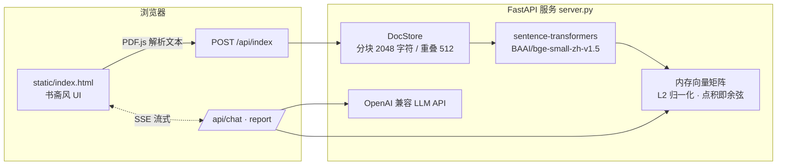

# 径舟 · JingZhou

> 书山有径，学海泛舟。

**径舟** 是一个基于语义检索（RAG）的多文档 AI 学习助手。上传 PDF 文档后，它以书童「小舟」的口吻与你对答，并能从文档中自动生成闪卡、测验、思维导图、学习报告、信息图与数据表格。

后端为单文件 FastAPI 服务，前端为单文件古典书斋风页面，向量检索在本地内存中完成——除 LLM API 调用外，文档数据不出本机。

## 功能特性

| 功能 | 说明 |
| --- | --- |
| 💬 多文档问答 | 跨文档语义检索 + SSE 流式回答，逐条标注来源 `[来源: 文档名 片段N]`，支持自定义人设 |
| 🃏 笺卡（闪卡） | 自动提取关键概念、定义、公式，生成问答式记忆卡片 |
| 📝 测验 | 生成带区分度的选择题，并对每个错误选项做四类归因：概念混淆 / 公式遗忘 / 审题偏移 / 推导断裂 |
| 🧭 卷宗览图 | 将知识结构生成为 Markdown 层级大纲，经 markmap 渲染为交互式思维导图 |
| 📜 学习报告 | 流式输出含摘要、核心概念、关键发现的结构化报告 |
| 📊 信息图 | 提取关键数据点、对比组与概念流程，由 ECharts 可视化 |
| 📋 表格 | 从文档中抽取对比数据、指标参数，输出 Markdown 表格 |

## 技术架构



- **嵌入模型**：`BAAI/bge-small-zh-v1.5`，本地运行，默认走 `hf-mirror.com` 国内镜像下载
- **检索**：分块（2048 字符 / 512 重叠，按段落与句号智能切分）→ L2 归一化 → 点积余弦相似度 Top-8
- **生成**：OpenAI 兼容接口，可指向任意服务商（GPT / DeepSeek / Kimi / 本地 vLLM 等）
- **前端**：零构建单 HTML，PDF.js 在浏览器端解析 PDF，ECharts + markmap 负责可视化

## 快速开始

### 环境要求

- Python 3.10+
- 一个 OpenAI 兼容的 LLM API Key

### 1. 配置

在项目根目录创建 `.env`：

```env
LLM_API_KEY=sk-你的密钥
# 以下为可选项
LLM_BASE_URL=https://api.openai.com/v1   # 任意 OpenAI 兼容端点
LLM_MODEL=gpt-4o                          # 使用的模型
EMBED_MODEL=BAAI/bge-small-zh-v1.5        # 本地嵌入模型
```

### 2. 启动

**Windows 一键启动**：双击 `start.bat`（自动装依赖、起服务、开浏览器）。

**手动启动**：

```bash
pip install -r requirements.txt
python server.py
```

服务就绪后访问 <http://127.0.0.1:8777>。

> 首次启动需下载嵌入模型（约 100MB），已默认配置国内镜像。如遇网络问题，可在 `.env` 中设置 `HF_TOKEN`。

## API 一览

| 方法 | 路径 | 说明 |
| --- | --- | --- |
| `POST` | `/api/index` | 索引文档（doc_id + 纯文本，上限 10MB） |
| `POST` | `/api/remove` | 移除文档 |
| `GET` | `/api/docs` | 列出已索引文档 |
| `POST` | `/api/chat` | RAG 问答（SSE 流式，返回回答 + 来源片段） |
| `POST` | `/api/flashcards` | 生成闪卡（JSON） |
| `POST` | `/api/quiz` | 生成测验（含错因分析，JSON） |
| `POST` | `/api/mindmap` | 生成思维导图（Markdown） |
| `POST` | `/api/report` | 生成学习报告（SSE 流式） |
| `POST` | `/api/infographic` | 提取信息图结构化数据（JSON） |
| `POST` | `/api/table` | 提取数据表格（Markdown） |

## 项目结构

```
jingzhou/
├── server.py            # 后端：FastAPI + DocStore + 全部 API（单文件）
├── requirements.txt
├── start.bat            # Windows 一键启动脚本
├── static/
│   └── index.html       # 前端：古典书斋风单页应用（零构建）
└── 方案说明书/           # 项目方案书、演示 PPT 与视频
```

## 设计取舍

- **纯内存存储**：索引随进程退出而清空，换来零依赖、零配置——适合个人学习与课堂演示场景
- **单文件架构**：前后端各一个文件，牺牲工程化换取「拷走即跑」
- **CORS 全开放**：面向本机开发环境，如需暴露到公网请自行收窄

## 路线展望

- [ ] 向量持久化（SQLite / FAISS）
- [ ] 会话历史与多轮对话
- [ ] 更多文档格式（DOCX / Markdown / EPUB）
- [ ] 闪卡导出 Anki

---

径舟书斋，伴读不倦。📖
